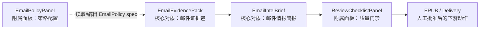

# Podsum Email Summary 总计划

## Summary

Podsum Email Summary 的主线是：先把邮件作为 Podcast 之外的第二类输入源接入现有 artifact 流程，再把这些 artifact 收敛成可审核、可标注、可批准的本地 VIS Workbench。

总目标分三层：

1. Email Summary 后台能力：扫描邮件，生成 `EmailEvidencePack`，生成 Hermes 摘要和 EPUB artifact。
2. VIS 对象模型：固定两个核心可视化工作对象和两个附属面板。
3. 本地 GUI Workbench：Podsum 提供手动启动的 localhost Web server，用来审核已有 artifact，不读 IMAP、不调用 Hermes、不发送、不接 launchd。

后续 README 和实施以本文档为准。旧的阶段性计划可以保留为历史记录。

## Object Model

核心可视化工作对象只有两个：

- `EmailEvidencePack`：邮件证据包，对应 `EmailReports/email-scan-YYYY-MM-DD.json`。用户需要看见、筛选、标注、锁定它，才能控制下游 Brief 的生成质量。
- `EmailIntelBrief`：邮件情报简报，对应 `EmailReports/email-summary-YYYY-MM-DD.md`。用户需要审核、编辑、确认和批准它，才能进入 EPUB 或发送阶段。

附属面板有两个：

- `EmailPolicyPanel`：策略配置面板，背后文件是 `outputs/email_link_policy.md`。它编辑声明式 `EmailPolicy` spec，但 `EmailPolicy` 本身不是核心可视化工作对象。
- `ReviewChecklistPanel`：质量门禁面板，背后逻辑来自 checklist 校验。它是 `EmailIntelBrief` 的审核视图，不升级为核心工作对象。

GUI 人工审核状态写入 sidecar：

```text
EmailReports/email-review-YYYY-MM-DD.json
```

sidecar 只保存人工标注、Brief 状态和 override，不覆盖 scan JSON 或 summary Markdown。



## Phases

### Phase 1：固化现有 Email Summary 能力

保留现有 CLI 和安全边界：

- `podsum.py email-summary`
- `podsum.py run-once --email-summary`
- `--scan-file`
- `--eml-dir`
- `--enrich-links`
- `--email-link-policy`
- 真实 IMAP 必须显式 `--allow-imap-read`
- 默认不抓网页，不发送，不修改邮箱状态，不接 launchd

文档措辞统一为：`EmailPolicy` 是声明式 Spec/config，不是核心可视化工作对象。

### Phase 2：定义 VIS GUI 规格

新增 GUI 规格文档：

```text
plans/podsum-email-workbench-gui-spec.md
```

规格必须定义对象关系、Workbench 布局、核心对象字段与状态、附属面板职责、异常状态和安全边界。

### Phase 3：实现本地 Email Workbench Server

新增手动启动命令：

```sh
/usr/bin/python3 outputs/podsum.py email-workbench \
  --root ~/Podcasts/AutoDownloads \
  --date 2026-07-05 \
  --host 127.0.0.1 \
  --port 8765
```

实现原则：

- 使用 Python stdlib `ThreadingHTTPServer`。
- 第一版不引入 npm、React、Vite。
- 只监听 `127.0.0.1`。
- 只读取 `--root/EmailReports` 和指定 policy 文件。
- 不提供 IMAP、Hermes、send、launchd API。
- 前端为单页 HTML/CSS/JS。

### Phase 4：实现 GUI 交互

Workbench 采用单页审核台：

- 左侧对象导航：`EmailEvidencePack`、`EmailIntelBrief`。
- 中间主工作区：当前核心对象。
- 右侧附属面板：`EmailPolicyPanel`、`ReviewChecklistPanel`、命令预览。
- 底部或顶部状态区：日期、账号、artifact 缺失状态、server mode。

用户操作只更新 review sidecar 或 policy 文件。重新扫描、链接补全、Hermes 摘要、发送，都只给出可复制 CLI 命令，不自动执行。

### Phase 5：验证与手动使用

验收重点：

- 缺 scan/summary 时 GUI 显示 missing 状态和建议命令。
- fixture scan/summary 能渲染 EvidencePack 与 IntelBrief。
- `POST /api/review` 只修改 sidecar，不改 scan/summary。
- policy 无效 JSON 保存失败，原文件不变。
- path traversal 被拒绝。
- API 不触发 IMAP、Hermes 或 send。
- 完整 unittest 通过。

手动流程：

1. CLI 生成 artifact。
2. 手动启动 Workbench。
3. 审核 EvidencePack。
4. 审核/编辑 IntelBrief。
5. 通过 ReviewChecklist。
6. 人工复制 GUI 给出的 CLI 命令做后续摘要重跑、EPUB 检查或发送。

## Explicitly Out Of Scope

- 不做完整邮件客户端。
- 不在 GUI 中读取真实 IMAP。
- 不在 GUI 中调用 Hermes。
- 不在 GUI 中真实发送。
- 不修改 `com.local.podsum.plist`。
- 不默认覆盖原始 scan/summary 文件。
- 不开放公网访问。
- 不提交 raw 邮件、真实账号、真实邮箱地址或凭据。
