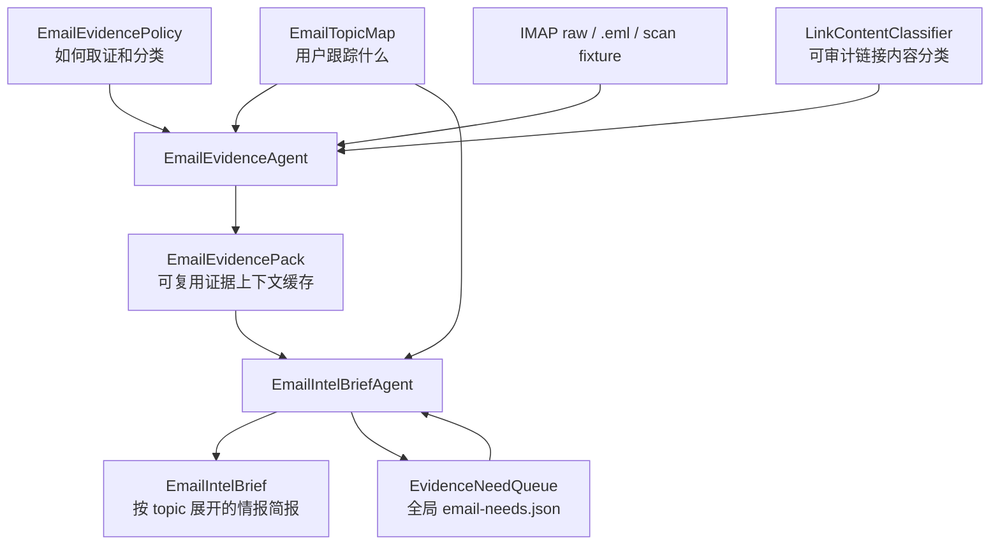

# Podsum Email Two-Agent Intelligence PRD

## Problem Statement

Podsum Email Summary 现在已经能从邮件生成 `EmailEvidencePack`，再生成
`EmailIntelBrief`，并通过 Workbench 可视化审核四个核心工作对象。但是当前模型仍然偏
pipeline：读取邮件，补 links，生成 summary，做 checklist。这个模型不足以支撑高质量
email intelligence。

Email 和 podcast 最大的不同是：podcast 转写完成后，主要内容已经在 Markdown 里；
email 本身通常只是一组入口。真正有价值的信息常常在邮件里的公开链接、引用页面、
附件提示、thread 上下文或后续邮件里。`EmailEvidencePack` 的目的不是在第一遍就做出
最终判断，而是把原始邮件和链接内容转成可复用、可追溯、可直接消费的上下文缓存，让下游
brief 生成不需要反复抓链接，也不需要依赖外部记忆。

当前缺口是：`EmailIntelBrief` 在生成过程中发现证据不足时，只能在 brief 中写
“待外部验证”，无法把这个需求落到持久化队列。下一次有新邮件或新链接证据出现时，系统
也无法知道之前哪个 brief 对哪个话题、claim 或问题提出过持续证据需求。

## Goals

- 把 Email Summary 重构为 Podsum 自己拥有的双 agent 系统：
  - `EmailEvidenceAgent`：负责构建和维护 `EmailEvidencePack`。
  - `EmailIntelBriefAgent`：负责基于 `EmailTopicMap` 和 `EmailEvidencePack` 生成
    `EmailIntelBrief`。
- 引入持久化的 `EvidenceNeed`，让 BriefAgent 对更多证据的需求可以进入全局
  `EvidenceNeedQueue`，并在后续 Brief generation 中被重新检查。
- 明确 `EmailEvidencePack` 是上下文缓存和来源索引，不是最终情报判断。
- 明确 EvidenceAgent 默认是确定性数据管道，仅允许一个可审计的
  `LinkContentClassifier` AI 分类点用于链接内容类型判断。
- 明确 Podsum 的 summary engine 默认属于 Podsum 本身，不依赖 Hermes；这里的解耦只指
  summary engine，发送链路可以继续使用 Hermes。
- 让 Workbench 能可视化五个核心工作对象，以及 `EvidenceNeedQueue` 中的证据需求状态。
- 保持现有 CLI artifact 流程可回归，逐步替换内部算法和对象模型。

## Non-Goals

- 不把 Podsum 变成完整邮件客户端。
- 不把 Hermes 作为 Email Summary 的默认 summary engine。
- 不要求第一版实现复杂多轮 autonomous agent runtime。
- 不把 `EvidenceNeed` 做成聊天消息流，需求必须落到可版本化对象。
- 不把 open `EvidenceNeed` 做成 approval 或 delivery 门禁；它是 brief 内容和持续追踪对象。
- 不替换 podcast 现有摘要流程。
- 不在本 PRD 中定义生产定时任务、真实发送批准流或 launchd 接入。

## Users

- Podsum 用户：每天审阅邮箱中和自己长期 topic 相关的情报、行动项和风险。
- Podsum 运维者：需要确认真实 IMAP、fixture、Workbench、artifact、EPUB 等路径稳定。
- Podsum 开发者：需要通过 fixture 和可视化对象调试 evidence 到 brief 的质量问题。

## Core Concepts

### EmailTopicMap

`EmailTopicMap` 是用户正在跟踪的话题对象。它决定哪些邮件、链接内容和 evidence 值得
进入主线 brief，也决定 BriefAgent 先围绕哪些主题展开。

它包含：

- topic id、name、priority。
- description、examples、non_examples，避免 topic 只有关键词而不可理解。
- keywords、aliases。
- summary_focus。
- default_behavior，用于处理未命中 topic 的邮件。

### EmailEvidencePolicy

`EmailEvidencePolicy` 是 evidence 生成策略对象。它决定邮件如何分类，哪些类型需要抓
links，哪些链接应跳过，单封和全局抓取预算是多少，以及链接内容如何分类。

GUI 中可以继续称为 `EmailPolicyPanel`，但数据层应清楚表达它是 EvidenceAgent 的输入
策略，而不是 brief 的内容对象。

### EmailEvidencePack

`EmailEvidencePack` 是 EvidenceAgent 的主要输出。它是面向 BriefAgent 的上下文缓存，
不是简单 scan JSON，也不是最终结论。

它必须包含：

- scan metadata：日期、账号、时间窗口、limit、raw_count、truncated 状态。
- email item metadata：uid、from、subject、date、snippet、附件形态、MIME 形态。
- extracted links：URL、anchor/context、link decision、skip reason。
- evidence contexts：邮件自身 snippet、已抓取公开网页 cleaned 正文、页面 title、fetch
  metadata。
- topic matches：每封邮件命中的 topics 和顶层 topic_hits。
- risks：snippet_only、link_failed、tracking_skipped、truncated、charset_loss 等。
- source refs：所有 evidence 能追溯回邮件 UID、link URL 和处理步骤。
- evidence agent annotations：哪些内容是确定性读取，哪些链接分类来自确定性规则或
  `LinkContentClassifier`。

`EmailEvidencePack` 的价值是：当 BriefAgent 生成 brief 时，它应该主要消费 pack 中已
准备好的 evidence，而不是自己重新读 IMAP、重新抓 link 或直接依赖外部记忆。Pack 保存
清洗后的正文和 source refs，不做 LLM 压缩；正文长度与取舍由 BriefAgent 在生成 brief 时
处理。

### EmailIntelBrief

`EmailIntelBrief` 是 BriefAgent 的主要输出。它是按 `EmailTopicMap` 展开的邮件情报
简报。

它必须包含：

- key takeaway。
- 跟踪话题展开。
- 需要处理。
- 值得知道。
- 可以忽略。
- 如果只记三件事。
- 来源索引。
- 证据边界和 source coverage。
- review checklist。
- BriefAgent 产生的 `EvidenceNeed` 列表或引用。

`EmailIntelBrief` 不应只是 inbox digest。它应该回答：这些邮件和链接对我正在跟踪的
topic 有什么新证据、新风险、新机会、新待办。

### EvidenceNeed

`EvidenceNeed` 是 BriefAgent 产生和维护的持续追踪对象。它不是临时 prompt 文本，也不是
approval/delivery 门禁，而是可持久化、可审核、可追踪的工作对象。

它表示：BriefAgent 在生成某个 brief、处理某个 topic 或 claim 时，认为现有 evidence
不足，需要后续 Brief generation 在新的 EvidencePack 中继续检查。

字段建议：

- `need_id`：稳定 ID。
- `created_by`：产生需求的 BriefAgent 版本。
- `created_at`：创建时间。
- `source_brief_id`：来自哪个 Brief draft。
- `topic_id`：关联 topic。
- `claim_or_question`：需要补证据的问题或判断。
- `why_needed`：为什么当前 evidence 不足。
- `known_source_refs`：目前已有的 UID、URL、evidence refs。
- `needed_evidence`：需要哪类证据，例如更多原文、公开网页、后续邮件、官方公告。
- `urgency`：low、medium、high。
- `status`：open、fulfilled_now、watching、blocked、stale、superseded、closed。
- `response_policy`：后续扫描时检查、只记录不主动抓取、用户手动关闭。
- `last_checked_at`。
- `resolved_by`：满足该 need 的 EvidencePack version 或 evidence refs。
- `audit_trail`：BriefAgent 或系统状态迁移的处理记录。

`EvidenceNeed` 的重点是持续性：如果当前 brief 无法回答某个问题，它应该记住这个需求。
未来有新邮件、新链接或重新 enrichment 时，下一次 Brief generation 会读取全局
`EvidenceNeedQueue`，用新的 `EmailEvidencePack` 重新判断这些 needs 是否已满足、过期、被
替代或仍需继续观察。Open need 不阻止 brief approval 或 delivery，它必须作为 brief 的证据
边界和持续追踪内容被展示。

### EvidenceNeedQueue

`EvidenceNeedQueue` 是跨日期的全局需求队列，第一版作为第五个核心 VIS 工作对象。它不是
聊天记录，而是 `EvidenceNeed` 的持久化 store 和管理视图。

它包含：

- 全局单一 store：`email-needs.json`。
- open、watching、blocked、stale、superseded、closed 等状态的 needs。
- 按 urgency、topic、status、created_at、last_checked_at 的筛选和排序。
- source brief、source refs、resolved_by 和 audit_trail。
- 用户手动 close 或 stale 的操作记录。

Workbench 中 `EvidenceNeedQueue` 需要独立 `Needs` tab。第一版允许查看、过滤、排序和手动
close/stale，不允许随意改写 `claim_or_question`，避免污染审计链。

## Product Flow

## Agent Responsibilities

### EmailEvidenceAgent

EvidenceAgent 负责把邮件输入转成可复用 evidence。它默认是确定性数据管道，只允许一个
边界清晰、可审计的 AI 点：`LinkContentClassifier`。

职责：

- 从 IMAP raw、`.eml` fixture 或已有 scan 读取邮件。
- 确定性提取 metadata、MIME 结构、snippet、附件形态和 links。
- 按 `EmailEvidencePolicy` 做邮件分类、链接决策和抓取预算控制。
- 抓取公开链接内容，清洗 HTML，保存 cleaned 正文和 source refs。
- 使用 `topic.md` 中的 keywords、aliases 做 topic keyword selection。
- 使用确定性规则跳过 tracking、unsubscribe、social、mailto、已知广告域名等明显无效链接。
- 在需要时调用可审计的 `LinkContentClassifier`，把链接标为 content、ad、sponsor、navigation、
  tracking 或 unknown。分类结果必须写入 EvidencePack，包括 decision_source、decision_reason、
  classifier_version 和 confidence。
- 应用 `EmailTopicMap`，生成 item topics 和 topic_hits。
- 保证 EvidencePack 中每条 evidence 都能追溯到来源和处理方式。

EvidenceAgent 不负责写最终 brief，不做 LLM summary/compression，不做 semantic need
reconciliation，不判断 claim 是否成立。它可以对 link 做分类，但分类必须作为 evidence
annotations 进入 pack，而不是隐藏在 prompt 里。

### EmailIntelBriefAgent

BriefAgent 负责从 EvidencePack 生成 Brief，并把证据缺口明确反馈给 EvidenceAgent。

职责：

- 读取 `EmailTopicMap` 和 `EmailEvidencePack`。
- 先按 high priority topic 展开，再处理 medium/low priority topic 和 topic 外待办。
- 使用 EvidencePack 中的 link evidence、email snippet evidence、risk 和 source refs。
- 标注 evidence boundary，例如 snippet_only、link_failed、truncated。
- 生成 `EmailIntelBrief` draft。
- 生成或更新 `EvidenceNeed`：
  - 某个 claim 只有 snippet，没有 link 原文。
  - 某个高优先级 topic 出现信号，但 evidence 不足以判断。
  - 某个链接失败，但主题重要。
  - 某个 thread 看起来有后续关系风险，需要等待下一封邮件。
- 读取全局 `EvidenceNeedQueue`，用当前 `EmailEvidencePack` 判断旧 needs 是否 fulfilled、
  watching、blocked、stale、superseded 或 closed。
- 不直接读 IMAP，不直接抓网页，不直接调用 Hermes 作为默认 summary engine。

BriefAgent 可以产生和更新 EvidenceNeed，但不能绕过 EvidenceAgent 自己取证。这样 Podsum 的
evidence 和 brief 能保持可审计、可复用和可回归。

## Agent Communication Contract

两个 agent 不通过自由文本聊天通信，而通过结构化 artifacts 通信：

- EvidenceAgent 写入 `EmailEvidencePack`。
- BriefAgent 读取 `EmailEvidencePack` 和全局 `EvidenceNeedQueue`。
- BriefAgent 生成 `EmailIntelBrief`，并新增或更新 `EvidenceNeed`。
- 下一次 Brief generation 使用新的 `EmailEvidencePack` 重新检查旧 needs。

需要持久化的不是聊天消息，而是 `EvidenceNeed` 的版本化状态更新。每次状态迁移至少表达：

- need_id。
- old_status 和 new_status。
- response_summary。
- added_evidence_refs。
- checked_pack_version。
- next_check_policy。
- reason。

Workbench 应能展示：

- 哪个 Brief 产生了这个 need。
- 哪次 Brief generation 更新了这个 need。
- 哪些新 evidence 满足了这个 need。
- 哪些 need 仍在 watching。
- 当前 Brief 明确承认哪些证据缺口。

## Visual Work Objects

第一版升级为五个核心 VIS 工作对象：

- `EmailTopicMap`：用户控制“关注什么”。它是两个 agent 的共同输入。
- `EmailPolicyPanel / EmailEvidencePolicy`：用户控制“如何取证和分类”。它主要驱动
  EvidenceAgent。
- `EmailEvidencePack`：EvidenceAgent 输出的证据上下文缓存。
- `EmailIntelBrief`：BriefAgent 输出的可审核情报简报。
- `EvidenceNeedQueue`：跨日期的全局 needs 管理视图。

`EvidenceNeedQueue` 在 Workbench 中作为独立 `Needs` tab 展示。第一版支持查看、过滤、
排序、跳转 source refs、查看 audit trail，以及手动 close/stale。Open needs 不阻止 approval
或 delivery，它们作为 brief 的证据边界和持续追踪内容展示。

## User Stories

1. 作为用户，我希望先编辑 `EmailTopicMap`，让 Email Summary 围绕我正在跟踪的话题
   展开，而不是生成宽泛 inbox digest。

2. 作为用户，我希望编辑 `EmailPolicyPanel`，明确哪些类型邮件需要抓 link，哪些链接
   应该跳过，避免 evidence 堆在一起看不懂。

3. 作为用户，我希望 EvidenceAgent 把真实邮件里的链接正文提前读出来、清洗并保存进
   `EmailEvidencePack`，这样 BriefAgent 不需要重复抓取链接。

4. 作为用户，我希望 `EmailEvidencePack` 告诉我每条 evidence 来自哪里，是邮件摘要、
   链接正文、确定性规则、AI 链接分类，还是失败或跳过记录。

5. 作为用户，我希望 BriefAgent 生成 brief 时，如果发现某个结论证据不够，明确提出
   `EvidenceNeed`，而不是只在正文里含糊写“待验证”。

6. 作为用户，我希望 BriefAgent 在后续 brief generation 中读取旧 `EvidenceNeed`，判断哪些
   已被新 evidence 满足，哪些需要继续观察，哪些因为链接失败或权限问题暂时无法处理。

7. 作为用户，我希望下次有新邮件进入 EvidencePack 时，系统能自动检查这些新 evidence
   是否满足之前 BriefAgent 提出的持续需求。

8. 作为用户，我希望 Workbench 能从 Brief 的某个判断跳回对应 UID、link evidence 和
   EvidenceNeed 状态。

9. 作为用户，我希望 Email Summary 默认由 Podsum 本身完成，Hermes 只是可选外部引擎，
   避免 Podsum 和 Hermes 记忆、环境变量、prompt 过度耦合。

10. 作为开发者，我希望 fixture 能覆盖 EvidenceNeed 生命周期：立即满足、等待后续、
    链接失败、topic 命中但证据不足、未来 scan 补齐。

## Functional Requirements

### FR1: EvidencePack Generation

系统必须能从 IMAP、`.eml` fixture 或 scan fixture 生成标准化
`EmailEvidencePack`。生成过程分层：

- Reader layer：确定性读取邮件 metadata、MIME、snippet、links。
- Fetch layer：按 policy 抓取公开 link 内容。
- Link classification layer：用确定性规则和可审计 `LinkContentClassifier` 标注 link 内容类型。
- Topic keyword selection layer：用 `EmailTopicMap` 的 keywords、aliases 粗筛相关 link。
- Topic matching layer：应用 `EmailTopicMap`。

### FR2: EvidencePack as Context Cache

`EmailEvidencePack` 必须优先保存 BriefAgent 可直接使用的 cleaned 正文和来源索引，而不是
只保存链接列表。每个 link evidence 必须包含：

- URL。
- link title。
- cleaned body。
- source UID。
- fetch status。
- cleaned body metadata。
- risk or boundary。

### FR3: Brief Generation

BriefAgent 必须只基于 Podsum 提供的对象工作：

- `EmailTopicMap`。
- `EmailEvidencePack`。
- active `EvidenceNeed` 状态。

BriefAgent 不应直接读 IMAP 或抓 link。它可以生成新的 `EvidenceNeed`，并在后续 brief
generation 中基于新的 EvidencePack 更新旧 needs 的状态。

### FR4: EvidenceNeed Lifecycle

系统必须支持 `EvidenceNeed` 的生命周期：

- open：BriefAgent 新提出。
- fulfilled_now：BriefAgent 在当前 EvidencePack 中确认已有 evidence 满足。
- watching：当前无法满足，但未来新 evidence 可能满足。
- blocked：因权限、失效、超预算、不可访问等原因阻塞。
- stale：长时间没有新 evidence，且 topic 或 claim 已不重要。
- superseded：被更新的 need 或新 evidence 覆盖。
- closed：用户或系统确认不再需要。

### FR5: Workbench Review

Workbench 必须能展示：

- 五个核心 VIS 工作对象。
- EvidencePack 中每封邮件的 evidence health 和 link classification。
- Brief 中每个重要判断的 source refs。
- BriefAgent 产生和更新的 EvidenceNeeds。
- 独立 `EvidenceNeedQueue` 中每个 need 的状态、audit trail 和关联 evidence。
- open needs 的 urgency 排序和高亮；open needs 不阻止 approval 或 delivery。

### FR6: Provider Decoupling

Podsum 必须定义自己的 agent interfaces 和 artifact schema。底层 AI provider 可以是本地
模型、OpenAI、Hermes CLI 或 fake provider，但这些 provider 不应定义 Podsum 的对象边界。

默认 summary path 是 Podsum-owned engine。Hermes 只能作为显式配置的外部 provider。

## Non-Functional Requirements

- 可回归：fixture-only 测试不访问 IMAP、外部网页、Hermes 或 delivery。
- 可追溯：Brief 中的关键判断必须能回到 UID、URL 和 evidence refs。
- 可复用：EvidencePack 可被多次 Brief generation 使用。
- 可审计：AI 链接分类、确定性规则命中和跳过理由必须进入 artifact。
- 可替换：AI provider 可替换，agent contract 不变。
- 可视化：核心对象必须能在 Workbench 中看见、筛选、跳转和审核。

## Implementation Decisions

### Object and Schema Strategy

核心工作对象使用 Python `@dataclass` 建模，并通过显式 serializer/deserializer 写入 JSON 或
Markdown artifacts。状态字段使用 `Literal[...]` 表达允许值，不引入 pydantic。

`EvidenceNeed` 状态迁移使用纯函数，例如 `transition_need(need, event) -> EvidenceNeed`，
避免在数据对象上隐藏副作用。外部/API/fixture 数据在反序列化边界做运行时校验；需要字段
必须存在，多余字段可以忽略。

### Module Shape

建议把现有单体邮件流程拆成几个深模块：

- `EmailEvidenceAgent`：对外提供 build、enrich、classify_links。
- `EmailIntelBriefAgent`：对外提供 compose、emit_needs、reconcile_needs。
- `EvidenceNeedStore`：负责全局 `email-needs.json`，持久化 active needs、历史响应和状态迁移。
- `EvidencePackStore`：负责 pack 版本、source refs 和 sidecar 关系。
- `SummaryProvider`：Podsum local、Hermes、fake provider 等适配层。

内部可以继续复用现有 reader、link enrichment、topic matching 和 Workbench API，
但对外边界要从 pipeline 函数升级为 agent contract。

### Artifact Strategy

保留已有文件命名和兼容路径：

- `EmailEvidencePack` 继续落到 daily scan artifact。
- `EmailIntelBrief` 继续落到 daily summary artifact。
- Review sidecar 继续保存人工标注和 brief override。

新增持久化对象：

- `EvidenceNeedStore` 第一版使用全局单一 `email-needs.json`。
- 每个 need 必须记录 source brief、topic、source refs、status 和 response trail。

### Algorithm Strategy

EvidenceAgent 的算法是确定性为主、单点 AI 分类为辅：

- 确定性：读取邮件、解析 MIME、抽 links、执行 skip rules、保存 source refs。
- AI 辅助：仅允许可审计 `LinkContentClassifier` 对 link 内容类型做分类。

BriefAgent 的算法主要是 AI 辅助：

- 按 TopicMap 和 evidence context 组织情报。
- 对每个重点判断绑定 source refs。
- 识别证据不足并生成 EvidenceNeed。

两者的关键区别：

- EvidenceAgent 面向可复用上下文和证据完整性。
- BriefAgent 面向用户决策、topic 叙事、缺口反馈和 need reconciliation。

### Workbench Strategy

Workbench 第一轮不用做完整 agent 控制台，但要让用户看见 agent 对象：

- EvidencePack 视图显示 link classification、cleaned 正文、source refs 和 evidence health。
- Brief 视图显示该 brief 产生和更新的 EvidenceNeeds。
- Policy 视图显示 EvidenceAgent 当前 link/enrichment/classification 策略。
- TopicMap 视图显示哪些 topic 有 open needs。
- Needs 视图集中展示全局 EvidenceNeedQueue。

## Acceptance Criteria

- 从 fixture `.eml` 生成 EvidencePack 时，pack 中包含 email evidence、link decisions、
  source refs、topic matches 和 evidence health。
- 当 link 已抓取并可用时，BriefAgent 不重新抓 link，只使用 EvidencePack。
- 当 BriefAgent 遇到 high priority topic 但证据不足时，会生成结构化
  `EvidenceNeed`。
- BriefAgent 能基于新的 EvidencePack 将 `EvidenceNeed` 更新为 fulfilled_now、watching 或
  blocked。
- watching need 能在下一次 Brief generation 时被重新检查。
- Workbench 能在独立 `EvidenceNeedQueue` 中展示 EvidenceNeed 的创建来源、状态、响应和关联
  evidence。
- `EmailIntelBrief` 中的关键判断能跳回 UID 和 evidence refs。
- 默认 summary engine 不调用 Hermes。
- fixture-only 测试不访问 IMAP、外部网页、Hermes 或 delivery。
- 现有 Email Summary CLI 和 Workbench 基础能力不回退。

## Test Plan

- Unit tests:
  - EvidenceNeed schema validation。
  - EvidenceNeed status transition。
  - BriefAgent immediate fulfillment。
  - BriefAgent watching need reconciliation。
  - BriefAgent emits needs when evidence is snippet_only。
  - BriefAgent does not fetch links directly。

- Fixture tests:
  - newsletter link evidence enters pack。
  - high-priority topic with failed link creates need。
  - future scan satisfies previous watching need。
  - truncated scan keeps boundary warning。
  - unknown charset fixture keeps source refs and charset risk。

- Workbench tests:
  - EvidenceNeed queue renders.
  - Brief generated needs render.
  - clicking need jumps to evidence refs when available.
  - open needs render and sort by urgency without blocking approval.
  - closed or blocked low-priority need remains visible without blocking approval.

- Regression tests:
  - offline `.eml` summary still works.
  - scan-file summary still works.
  - dry-run does not call external services.
  - default summary path does not call Hermes.

## Rollout Plan

1. Freeze this PRD and reconcile current master plan wording.
2. Add dataclass schemas for core objects, `EvidenceNeed`, and `EvidenceNeedStore`.
3. Extract current evidence generation into `EmailEvidenceAgent` facade without changing behavior.
4. Add deterministic link policy + topic keyword selection boundaries.
5. Add auditable `LinkContentClassifier` seam and fake provider tests.
6. Extract current brief generation into `EmailIntelBriefAgent` facade without changing behavior.
7. Add BriefAgent need emission and reconciliation logic for immediate, watching and blocked cases.
8. Add Workbench visualization for `EvidenceNeedQueue` as an independent Needs tab.
9. Add future-scan reconciliation test where new evidence satisfies an old need.
10. Run full regression and only then consider real IMAP manual validation.

## Open Questions

- `LinkContentClassifier` 第一版使用哪个具体 provider，以及分类标签和 confidence 阈值如何定义？
- `email-needs.json` 的 closed/superseded retention 和 prune policy 如何设置？
- cleaned 正文的最大保存长度、附件策略和隐私脱敏策略如何设置？

