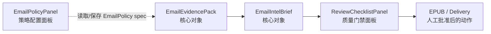

# Podsum Email Workbench GUI 规格

## Summary

Email Workbench 是 Podsum 的本地手动审核台。它读取已有 Email Summary artifact，把两个核心可视化工作对象呈现给用户，并通过两个附属面板提供策略调整和质量门禁。

它不是新的后台 runner，不自动读 IMAP，不自动调用 Hermes，不自动发送。

## Access

启动命令：

```sh
/usr/bin/python3 outputs/podsum.py email-workbench \
  --root ~/Podcasts/AutoDownloads \
  --date 2026-07-05 \
  --host 127.0.0.1 \
  --port 8765
```

访问地址：

```text
http://127.0.0.1:8765
```

在 macmini 上运行时，通过 SSH tunnel 访问：

```sh
ssh -L 8765:127.0.0.1:8765 macmini
```

## Object Relationship



`EmailPolicyPanel` 和 `ReviewChecklistPanel` 是附属面板，不进入核心对象导航。

## Layout

```text
+--------------------------------------------------------------------+
| Date / account / artifact status / local server mode               |
+----------------------+---------------------------------------------+
| Core object nav      | Main work area                              |
| - EvidencePack       | - EvidencePack view                         |
| - IntelBrief         | - IntelBrief view                           |
+----------------------+----------------------+----------------------+
| Agent progress / commands                  | Policy / Checklist    |
+--------------------------------------------+----------------------+
```

第一版用单页 HTML/CSS/JS 实现。左侧只导航两个核心对象；右侧面板随时可见。

## EmailEvidencePack View

输入文件：

```text
EmailReports/email-scan-YYYY-MM-DD.json
```

展示内容：

- scan metadata：date、account、window、scan_limit、raw_count、possibly_truncated。
- 分布：email_type、risks、attachments、links/evidence。
- 邮件列表：UID、From、Subject、Date、email_type、risk badges。
- 邮件详情：snippet、links、evidence、risks、attachments。

用户操作：

- 标记 `ignore`。
- 标记 `important`。
- 写入 `type_override`。
- 标记 `needs_link_review`。
- 从 Brief 来源索引跳转并高亮对应 UID。

这些操作只保存到：

```text
EmailReports/email-review-YYYY-MM-DD.json
```

不覆盖原始 scan JSON。

## EmailIntelBrief View

输入文件：

```text
EmailReports/email-summary-YYYY-MM-DD.md
```

展示内容：

- Markdown 渲染视图。
- 原始 Markdown 文本区。
- 来源索引解析结果。
- 当前 brief 状态：`draft`、`needs_revision`、`approved`。

用户操作：

- 编辑 brief override。
- 保存 override 到 review sidecar。
- 标记 `needs_revision`。
- 标记 `approved`。
- 点击 UID 回到 EvidencePack 对应邮件。

第一版不覆盖原始 summary Markdown；人工编辑内容只写入 sidecar 的 `brief_override_markdown`。

## EmailPolicyPanel

输入文件：

```text
outputs/email_link_policy.md
```

职责：

- 展示 policy Markdown。
- 解析 fenced JSON。
- 编辑 email type 规则、`fetch_links`、skip patterns、limits。
- 保存前校验 JSON。
- 保存失败时不覆盖原文件。

提示语必须说明：修改 policy 只影响后续 scan/enrich，不会自动重跑。

## ReviewChecklistPanel

输入：

- normalized `EmailEvidencePack`
- summary Markdown 或 sidecar brief override
- review sidecar

检查项：

- has_key_takeaway
- has_source_index
- has_uid_trace
- has_truncated_warning
- uses_link_evidence_when_available
- marks_snippet_only_claims
- ready_to_send

只有 checklist passed 且 brief 状态为 `approved` 时，才显示 EPUB/Delivery 的人工下一步命令。

## APIs

- `GET /api/context`：date、root、artifact paths、exists、mtime、server mode。
- `GET /api/evidence-pack`：normalized scan JSON，合并 review 标注。
- `GET /api/intel-brief`：summary Markdown、brief override、source index。
- `GET /api/policy`：policy Markdown 和解析后的 JSON。
- `POST /api/policy`：保存 policy Markdown；无效 JSON 时拒绝。
- `GET /api/checklist`：质量门禁结果。
- `POST /api/review`：保存 review sidecar 局部更新。
- `GET /api/commands`：返回可复制 CLI 命令。

## Failure States

- scan 缺失：显示 missing 状态和生成 scan 的 CLI 命令。
- summary 缺失：显示 missing 状态和基于 scan 生成 summary 的 CLI 命令。
- policy 解析失败：显示错误，不影响 EvidencePack 浏览，保存时拒绝覆盖。
- checklist 失败：显示失败项，禁止显示发送批准状态。
- path 越界：返回 404 或 403，不读取任意文件。

## Safety Rules

- 默认只绑定 `127.0.0.1`。
- 不提供 IMAP API。
- 不提供 Hermes API。
- 不提供 send API。
- 不提供 launchd API。
- 不修改邮箱状态。
- 不覆盖 scan JSON。
- 不默认覆盖 summary Markdown。
- policy 保存使用临时文件加原子替换。
